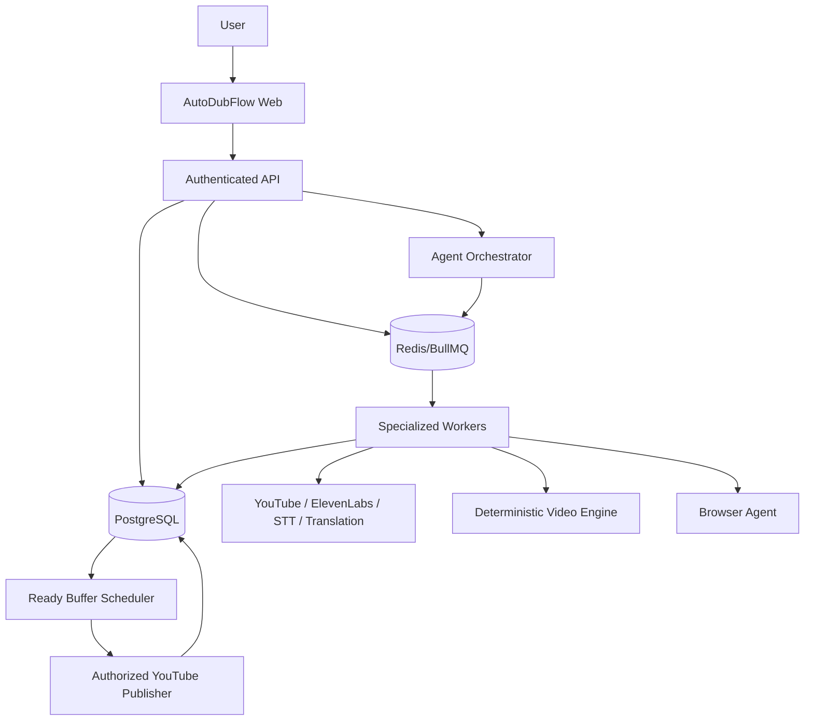
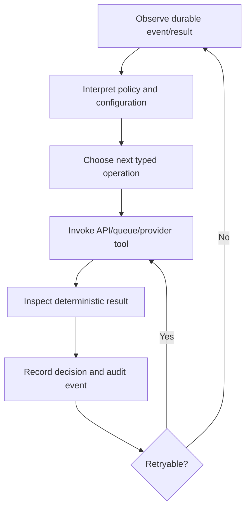
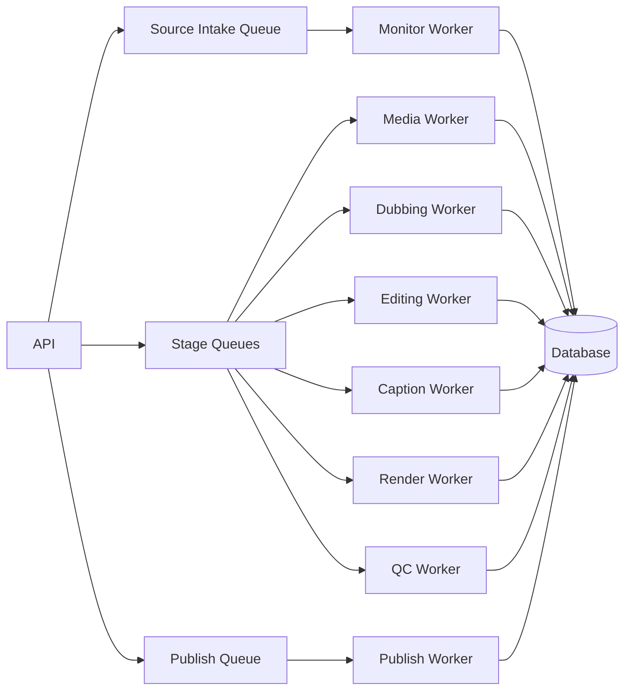
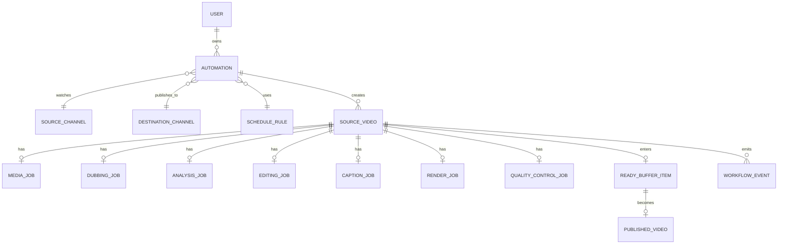
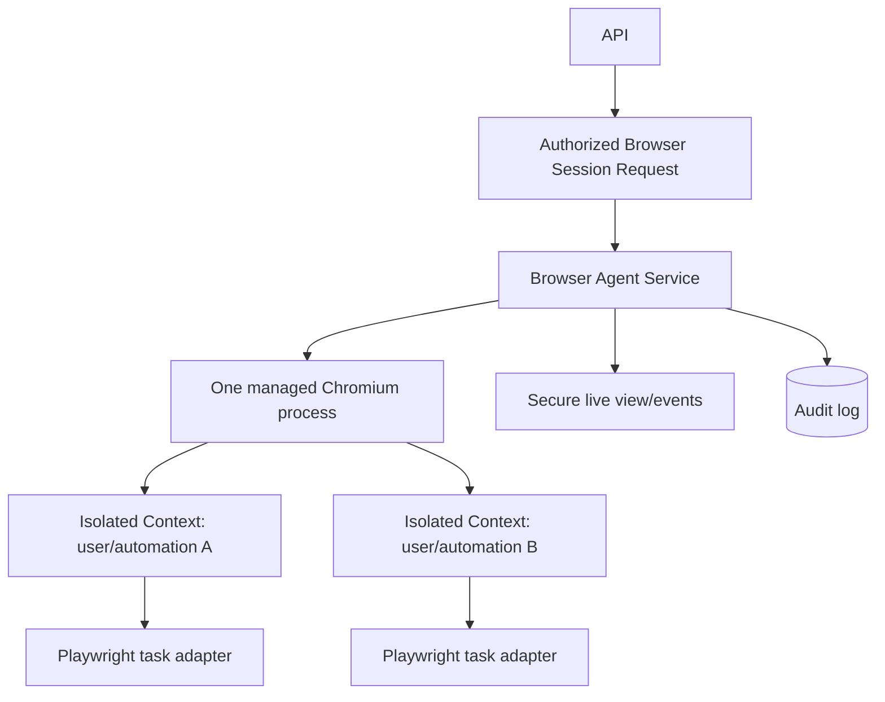
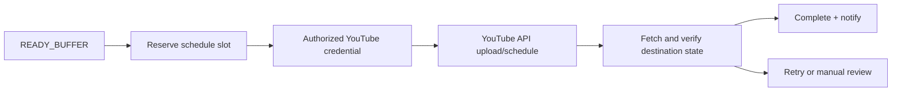
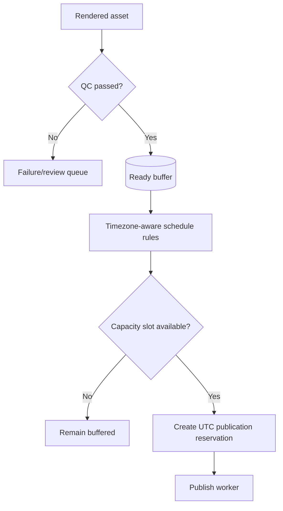

# System Diagrams

## Final product visualization

The following is the product-level target. It is intentionally more concrete than the service diagram below: an automation is configured once, source events start durable processing, rendered videos wait in a ready buffer, and the scheduler controls publication independently of processing.

```text
         +---------------------+
         |        USER         |
         +----------+----------+
            |
         Configure Once
            |
            v
        +---------------------------+
        |        AUTOMATION         |
        | Source Channel            |
        | Destination Channel       |
        | Language                  |
        | Videos / Day              |
        | Schedule                  |
        | Editing Template          |
        | Caption Template          |
        | Notifications             |
        +-------------+-------------+
              |
              v
           +--------------------+
           |   SOURCE MONITOR   |
           +----------+---------+
              |
         New Video Event
              |
              v
           +--------------------+
           | AGENT ORCHESTRATOR |
           +----------+---------+
              |
        +-----------------+-----------------+
        v                 v                 v
      Media Worker     Dubbing Worker    Analysis Worker
        |           ElevenLabs             |
        +-----------------+-----------------+
              v
           +--------------------+
           |  EDITING PIPELINE  |
           | Smart Reframe      |
           | Crop                |
           | Blur Background     |
           | Detect Captions     |
           | Mask Existing Text  |
           | Transitions         |
           | New Captions        |
           +----------+---------+
              v
            +-----------+
            |  RENDER   |
            +-----+-----+
              v
            +-----------+
            |    QC     |
            +-----+-----+
              v
           +------------------+
           |   READY BUFFER   |
           | Video A          |
           | Video B          |
           | Video C          |
           +--------+---------+
                           v
                     +-------------+
                     |  SCHEDULER  |
                     +------+------+
                          |
                  09:00 / 15:00 / 21:00
                          v
                   +-----------------+
                   | YOUTUBE PUBLISH |
                   +--------+--------+
                         v
                     +-----------+
                     | PUBLISHED |
                     +-----------+
```

## Independent visible browser surface

The browser agent is visible to the user when inspected, but it is not the execution dependency for the autonomous pipeline. Server-side workers and official provider APIs continue operating when the dashboard, browser tab, or user's computer is closed.

```text
      +---------------------+
      |    AGENT BROWSER    |
      +----------+----------+
             |
        Remote Chromium
             |
         Playwright
             |
      +--------------+--------------+
      v              v              v
     ElevenLabs       Editor UI      Other UI
```

Browser sessions are isolated by user and automation. Debugging ports remain private to the browser-agent service, and browser automation is an additional authorized adapter rather than the primary publishing mechanism.

## 1. System architecture



## 2. Source-video workflow

```mermaid
flowchart LR
  Event[SOURCE_EVENT] --> Eligible[ELIGIBILITY_CHECK]
  Eligible --> Ingest[MEDIA_INGESTION]
  Ingest --> Validate[MEDIA_VALIDATION]
  Validate --> Dub[DUBBING]
  Dub --> Analyze[VIDEO_ANALYSIS]
  Analyze --> Reframe[SMART_REFRAME]
  Reframe --> Burned[EXISTING_CAPTION_DETECTION]
  Burned --> Mask[CAPTION_MASK]
  Mask --> Transition[TRANSITIONS]
  Transition --> Caption[TARGET_CAPTION_GENERATION]
  Caption --> Render[RENDER]
  Render --> QC[QUALITY_CONTROL]
  QC --> Metadata[METADATA]
  Metadata --> Ready[READY_BUFFER]
  Ready --> Schedule[SCHEDULING]
  Schedule --> Publish[PUBLISH]
  Publish --> Verify[VERIFY]
  Verify --> Complete[COMPLETE]
```



## 3. Agent loop



## 4. Queue and worker architecture



## 5. Database relationships



## 6. Browser-agent architecture



## 7. Publishing pipeline



## 8. Ready-buffer scheduler


